# 🏗️ Price Pilot Multi-Agent Architecture Overview


## 🎯 **Enhanced Target Architecture (Recommended)**

```mermaid
graph TB
    User[👤 User Input] --> SessionMgr[🧠 Session Manager<br/>Context & Memory]
    SessionMgr --> IntentRouter{🎭 Intent Router<br/>Advanced NLU}
    
    %% Enhanced ChatAgent as Central Hub
    IntentRouter -->|"complex/conversational"| ChatAgent[💬 ChatAgent<br/>Conversation Intelligence]
    ChatAgent --> AgentCoordinator[🎯 Agent Coordinator<br/>Smart Delegation]
    
    %% Direct Routing for Simple Queries
    IntentRouter -->|"simple inventory"| InventoryAgent[📦 InventoryAgent]
    IntentRouter -->|"simple recommend"| RecommendAgent[🎯 RecommendAgent]
    IntentRouter -->|"simple order"| OrderAgent[🛒 OrderAgent]
    IntentRouter -->|"simple logistics"| LogisticsAgent[🚚 LogisticsAgent]
    IntentRouter -->|"simple forecast"| ForecastAgent[📈 ForecastAgent]
    
    %% ChatAgent Orchestrated Multi-Agent Workflows
    AgentCoordinator --> MultiFlow{Multi-Agent Workflows}
    MultiFlow --> |"Product Discovery"| ProductFlow[RecommendAgent → InventoryAgent]
    MultiFlow --> |"Purchase Journey"| PurchaseFlow[RecommendAgent → InventoryAgent → OrderAgent]
    MultiFlow --> |"Order Fulfillment"| FulfillmentFlow[OrderAgent → LogisticsAgent]
    MultiFlow --> |"Demand Planning"| PlanningFlow[ForecastAgent → InventoryAgent → OrderAgent]
    
    %% Response Synthesis
    ProductFlow --> ResponseSynthesizer[🔄 Response Synthesizer]
    PurchaseFlow --> ResponseSynthesizer
    FulfillmentFlow --> ResponseSynthesizer
    PlanningFlow --> ResponseSynthesizer
    
    %% Individual Agent Responses
    InventoryAgent --> ResponseSynthesizer
    RecommendAgent --> ResponseSynthesizer
    OrderAgent --> ResponseSynthesizer
    LogisticsAgent --> ResponseSynthesizer
    ForecastAgent --> ResponseSynthesizer
    
    %% Final Response
    ResponseSynthesizer --> ContextualResponse[📤 Contextual Response<br/>with Memory Update]
    ContextualResponse --> SessionMgr
    
    %% Data & External Systems
    subgraph "Data Layer"
        Database[(🗄️ Supabase)]
        VectorStore[(🧠 Vector Store<br/>Embeddings)]
        ConversationHistory[(💾 Conversation History)]
    end
    
    subgraph "External Systems"
        Carriers[🚛 Carriers<br/>Aramex, Naqel]
        PaymentGateway[💳 Payment Systems]
        ERPSystem[📊 ERP Integration]
    end
    
    SessionMgr --> ConversationHistory
    SessionMgr --> VectorStore
    
    style ChatAgent fill:#99ccff
    style AgentCoordinator fill:#ffcc99
    style ResponseSynthesizer fill:#cc99ff
    style SessionMgr fill:#99ff99
```



## 🔄 **Agent Communication Patterns**

### **1. Current Pattern: Hub-and-Spoke (Simple)**
```
User → Orchestrator → Single Agent → Response
```
- ✅ **Pros**: Simple, fast for basic queries
- ❌ **Cons**: No multi-agent coordination, limited context sharing

### **2. Recommended Pattern: Intelligent Orchestration**
```
User → SessionManager → ChatAgent → Multi-Agent Coordination → Response Synthesis → User
```

## 🎯 **Best Practices for Multi-Agent Systems**

### **1. Agent Coordination Patterns**

#### **A. Sequential Chain**
```python
# Example: Product Discovery → Stock Check → Order Creation
RecommendAgent → InventoryAgent → OrderAgent
```

#### **B. Parallel Execution**
```python
# Example: Multiple agents providing different perspectives
async gather(
    InventoryAgent.check_stock(product),
    RecommendAgent.find_alternatives(product),
    ForecastAgent.predict_demand(product)
)
```

#### **C. Conditional Routing**
```python
if intent == "complex_query":
    return ChatAgent.orchestrate_multi_agent_flow()
elif intent == "simple_inventory":
    return InventoryAgent.handle_direct()
```

### **2. State Management Strategies**

#### **A. Shared Context Pattern**
```python
class AgentContext(TypedDict):
    user_id: str
    session_id: str
    conversation_history: List[Message]
    current_intent: str
    extracted_entities: Dict
    agent_routing_history: List[str]
    partial_results: Dict[str, Any]
```

#### **B. Event-Driven Communication**
```python
class AgentEvent:
    event_type: str  # "product_found", "stock_checked", "order_created"
    source_agent: str
    target_agents: List[str]
    payload: Dict[str, Any]
    requires_response: bool
```

### **3. Response Synthesis Patterns**

#### **A. Template-Based Synthesis**
```python
def synthesize_response(agent_responses: Dict[str, str]) -> str:
    template = """
    Based on your request:
    🔍 Product Search: {recommend_response}
    📦 Stock Status: {inventory_response}
    💡 Recommendation: {final_recommendation}
    """
    return template.format(**agent_responses)
```

#### **B. LLM-Powered Synthesis**
```python
def intelligent_synthesis(responses: List[AgentResponse]) -> str:
    synthesis_prompt = """
    Combine these agent responses into a natural, helpful reply:
    {responses}
    
    Guidelines:
    - Maintain conversational flow
    - Highlight key information
    - Suggest next actions
    """
    return llm.generate(synthesis_prompt.format(responses=responses))
```

## 🔧 **Implementation Roadmap**

### **Phase 1: Enhanced Orchestrator (Week 1-2)**
1. **Smart Intent Detection**
   - Replace keyword matching with ML-based classification
   - Add confidence scoring for routing decisions
   - Implement fallback strategies

2. **Context-Aware Routing**
   - Pass conversation context to agents
   - Enable multi-turn conversations
   - Add session management

### **Phase 2: Agent Coordination (Week 3-4)**
1. **Multi-Agent Workflows**
   - Implement common workflow patterns
   - Add agent dependency management
   - Create response synthesis system

2. **Enhanced ChatAgent**
   - Build conversation intelligence
   - Add proactive agent coordination
   - Implement smart handoff management

### **Phase 3: Advanced Features (Month 2)**
1. **Learning & Optimization**
   - Add conversation analytics
   - Implement A/B testing for routing
   - Build performance monitoring

2. **Advanced State Management**
   - Implement vector-based memory
   - Add user preference learning
   - Create predictive routing

## 📊 **Agent Specialization Matrix**

| Agent | Primary Function | Best For | Integration Points |
|-------|------------------|----------|-------------------|
| **ChatAgent** | Conversation Management | Complex queries, multi-step workflows | All agents |
| **InventoryAgent** | Stock Management | Stock checks, availability | OrderAgent, RecommendAgent |
| **RecommendAgent** | Product Discovery | Product search, recommendations | InventoryAgent, OrderAgent |
| **OrderAgent** | Order Processing | Order lifecycle management | InventoryAgent, LogisticsAgent |
| **LogisticsAgent** | Shipping & Delivery | Tracking, fulfillment | OrderAgent |
| **ForecastAgent** | Demand Prediction | Planning, analytics | InventoryAgent, OrderAgent |

## 🎯 **Success Metrics**

### **Technical Metrics**
- Intent classification accuracy: >95%
- Multi-agent workflow success rate: >90%
- Response synthesis quality: >4.5/5
- Average response time: <2 seconds

### **Business Metrics**
- User task completion rate: >85%
- Customer satisfaction: >4.5/5
- Agent utilization efficiency: >80%
- Conversation resolution rate: >90%

---

## 🚀 **Next Steps**

1. **Implement Enhanced Intent Router** with ML-based classification
2. **Build Response Synthesis System** for multi-agent coordination
3. **Create Advanced Session Management** with context preservation
4. **Develop Agent Workflow Patterns** for common use cases
5. **Add Performance Monitoring** and analytics dashboard

This architecture provides scalability, maintainability, and excellent user experience while leveraging the strengths of each specialized agent.
